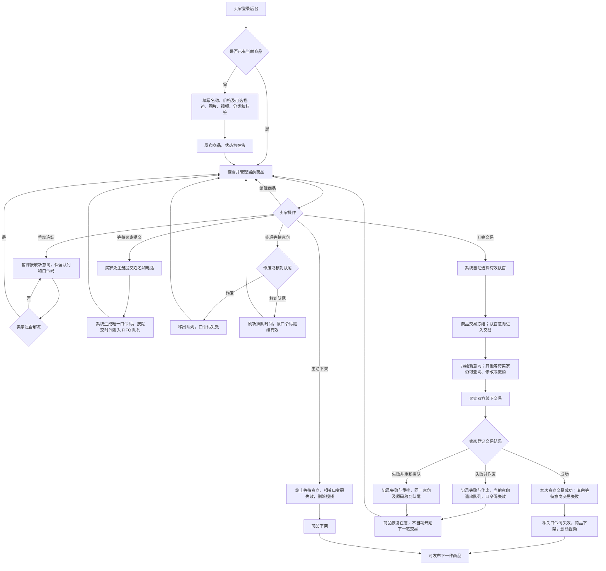
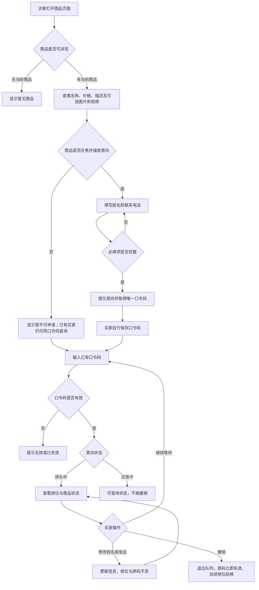
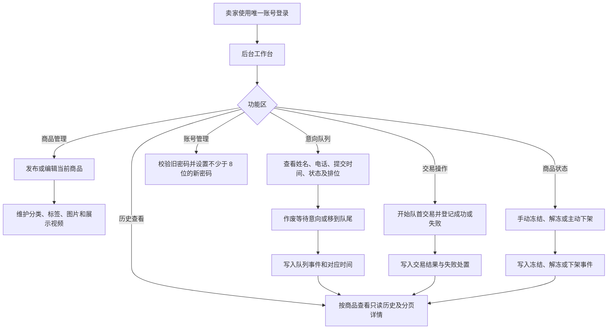
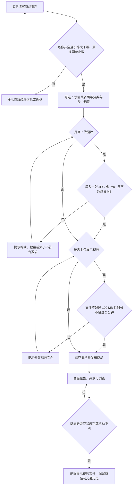

# 在线购物系统业务流程图

以下流程依据《在线购物系统需求规格说明书》，覆盖完整项目的买家、卖家和系统处理。交易在线下完成，系统负责排队、冻结、登记结果与保存历史。

## 1. 商品与交易主流程

主动下架只允许在商品可售且没有进行中的交易时执行；手动冻结须先解冻，交易冻结须先登记结果。每次提交、撤销、队列调整及交易结果都应写入该商品的业务记录。

## 2. 买家浏览、排队与口令码操作

“排队中”的买家即使遇到商品手动冻结或其他买家的交易冻结，也仍可修改联系信息或撤销。已经进入交易的买家不能撤销。

## 3. 卖家后台与历史记录

历史按商品组织。发生过交易失败的商品，即使随后恢复在售，也应在历史中保留失败流水；重新排队仍属于同一买家意向，历史需保留每次排队与重排事件。历史展示姓名、电话和业务结果，不展示口令码，定稿后只读。

## 4. 商品发布与媒体处理

