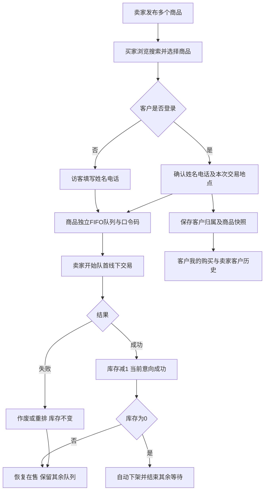
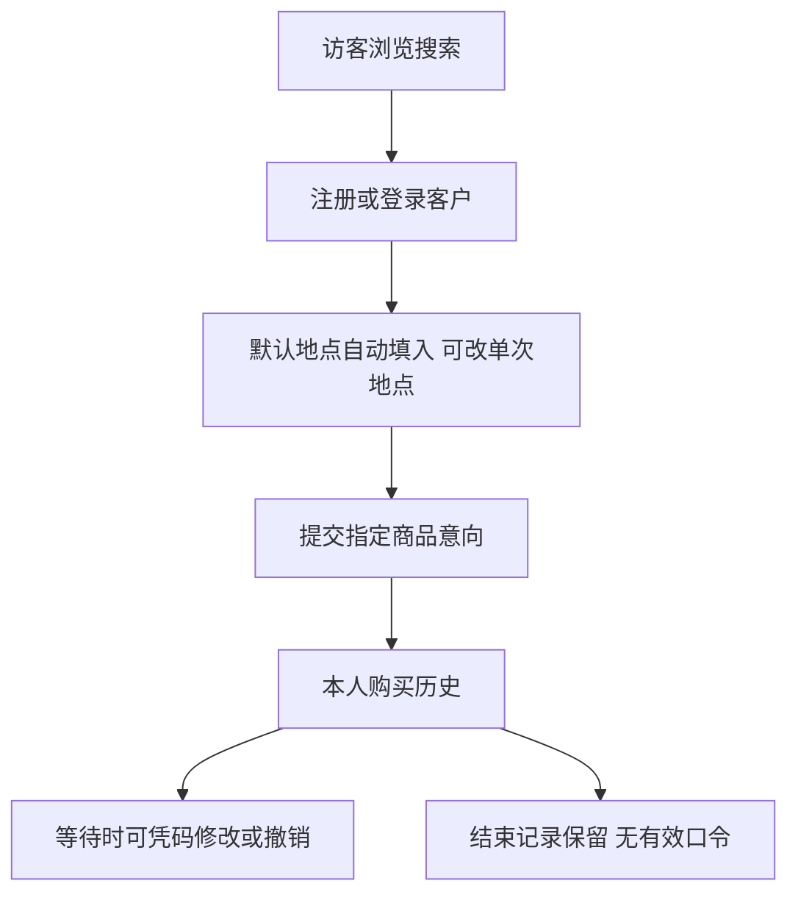
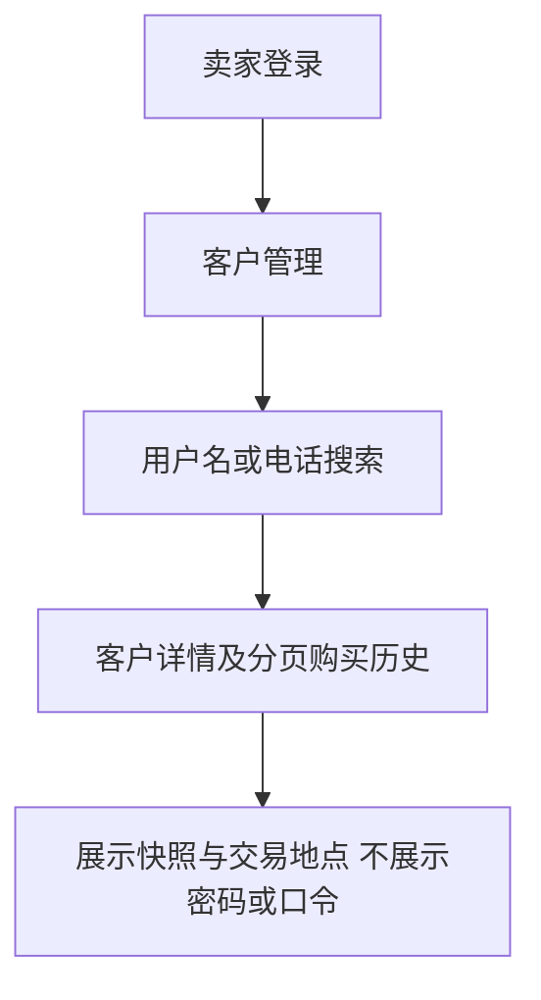
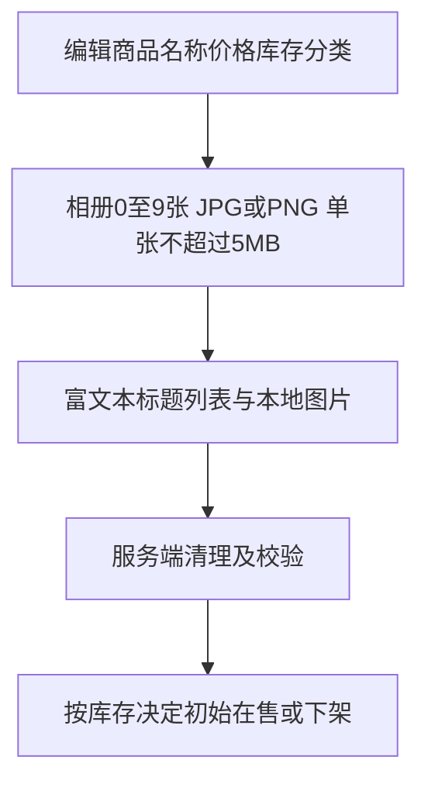

# 在线购物系统业务流程图

版本V3.0，2026-10-24。第三轮A.1与A.2，图中交易按指定商品独立处理。

## 商品与交易主流程

```mermaid
flowchart TD
 A[卖家发布多个商品] --> B[买家浏览搜索并选择商品]
 B --> C{客户是否登录}
 C -->|否| D[访客填写姓名电话]
 C -->|是| E[确认姓名电话及本次交易地点]
 D --> F[商品独立FIFO队列与口令码]
 E --> F
 E --> H[保存客户归属及商品快照]
 F --> G[卖家开始队首线下交易]
 G --> I{结果}
 I -->|失败| J[作废或重排 库存不变]
 I -->|成功| K[库存减1 当前意向成功]
 K --> L{库存为0}
 L -->|是| M[自动下架并结束其余等待]
 L -->|否| N[恢复在售 保留其余队列]
 J --> N
 H --> O[客户我的购买与卖家客户历史]
```

## 买家与客户历史

```mermaid
flowchart TD
 A[访客浏览搜索] --> B[注册或登录客户]
 B --> C[默认地点自动填入 可改单次地点]
 C --> D[提交指定商品意向]
 D --> E[本人购买历史]
 E --> F[等待时可凭码修改或撤销]
 E --> G[结束记录保留 无有效口令]
```

## 卖家客户管理

```mermaid
flowchart TD
 A[卖家登录] --> B[客户管理]
 B --> C[用户名或电话搜索]
 C --> D[客户详情及分页购买历史]
 D --> E[展示快照与交易地点 不展示密码或口令]
```

## 商品媒体

```mermaid
flowchart TD
 A[编辑商品名称价格库存分类] --> B[相册0至9张 JPG或PNG 单张不超过5MB]
 B --> C[富文本标题列表与本地图片]
 C --> D[服务端清理及校验]
 D --> E[按库存决定初始在售或下架]
```
