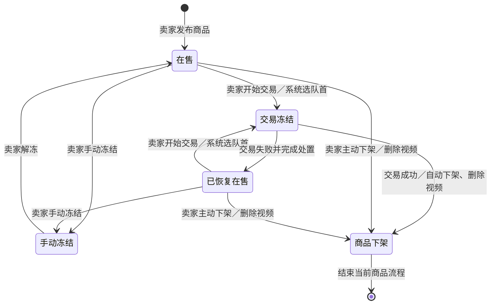
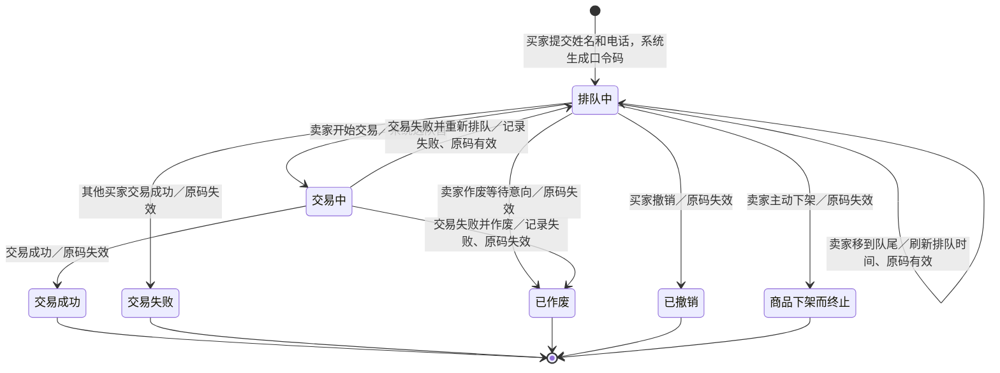
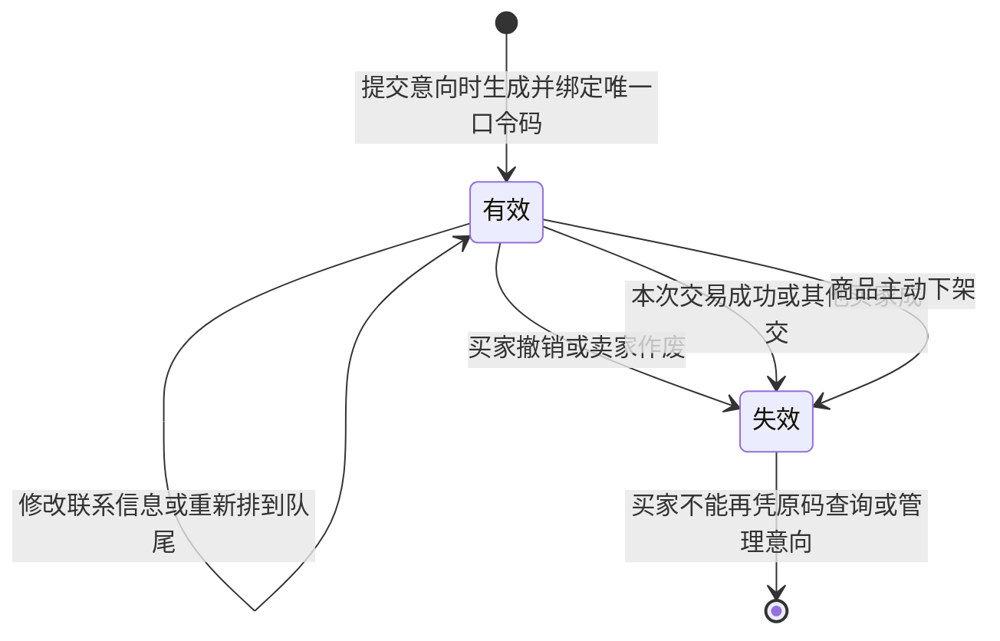

# 在线购物系统状态图

以下状态依据完整需求绘制。“交易失败后恢复在售”作为单独业务阶段展示，其接收意向、开始交易、手动冻结和主动下架的权限与普通在售相同。

## 1. 商品状态

手动冻结暂停新意向，但不生成交易结果；解冻后继续可售。交易冻结须先登记结果，不能直接解冻或下架。手动冻结须先解冻才能主动下架。下架后可以发布下一件商品，原商品的历史记录仍保留。

## 2. 购买意向状态

交易失败后必须在同一次操作中选择“作废”或“重新排队”，图中不把等待处置的失败结果画成可停留的状态。失败结果和处置均写入历史。冻结影响商品是否接收新意向，不改变现有等待买家的“排队中”状态；等待买家在冻结期间仍可查询、修改联系信息和撤销。

## 3. 口令码有效性

重新排队使用原意向、原口令码，不重新生成。口令码失效不删除历史中的姓名、电话和交易记录；卖家历史页面不展示口令码。
