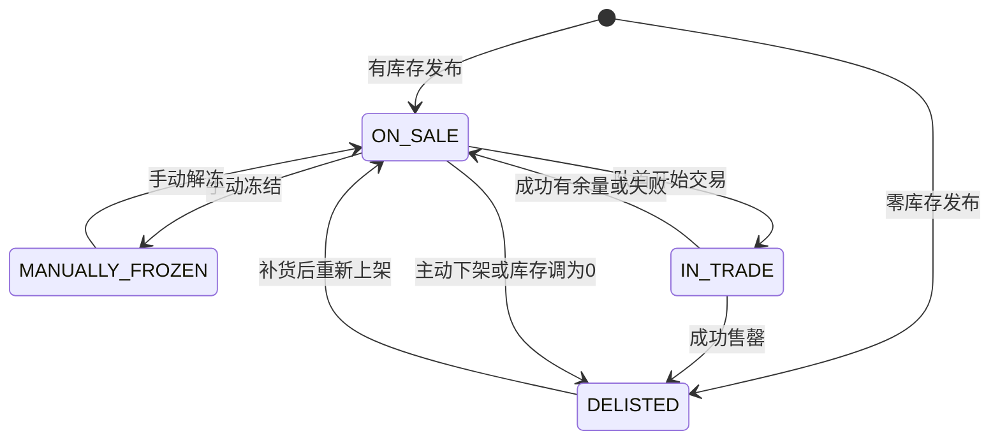
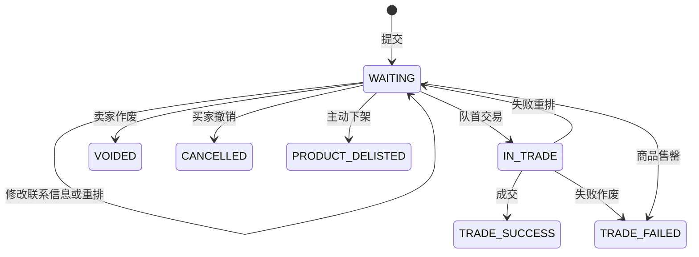
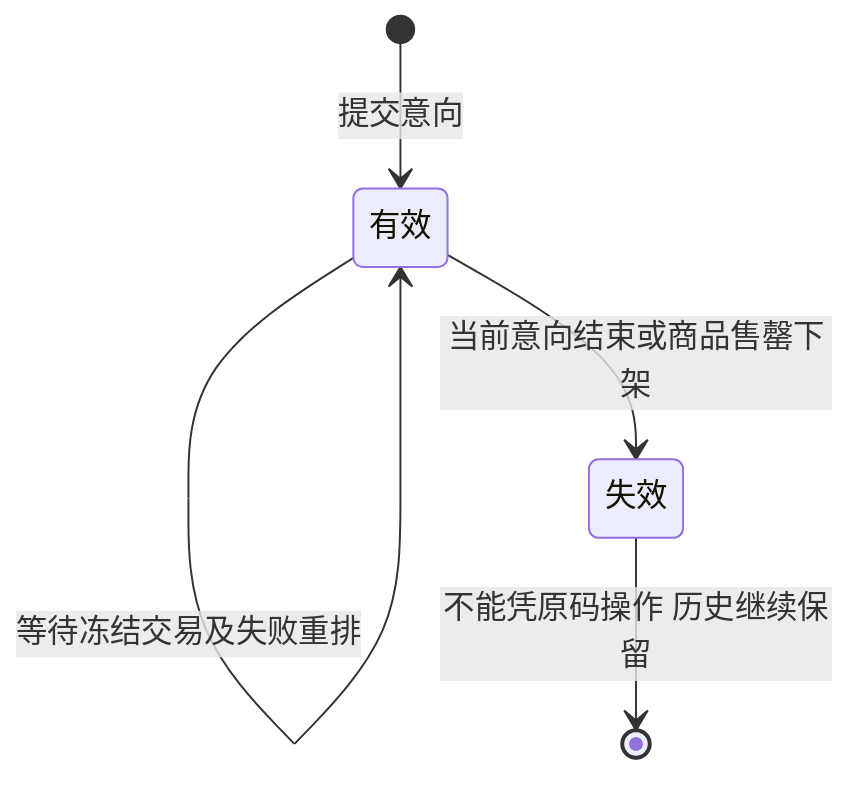

# 在线购物系统状态图

版本V3.0，2026-10-24。状态按商品隔离，客户历史独立于口令码有效性保留。

## 商品状态

```mermaid
stateDiagram-v2
 [*] --> ON_SALE: 有库存发布
 [*] --> DELISTED: 零库存发布
 ON_SALE --> MANUALLY_FROZEN: 手动冻结
 MANUALLY_FROZEN --> ON_SALE: 手动解冻
 ON_SALE --> IN_TRADE: 队首开始交易
 IN_TRADE --> ON_SALE: 成功有余量或失败
 IN_TRADE --> DELISTED: 成功售罄
 ON_SALE --> DELISTED: 主动下架或库存调为0
 DELISTED --> ON_SALE: 补货后重新上架
```

## 购买意向

```mermaid
stateDiagram-v2
 [*] --> WAITING: 提交
 WAITING --> WAITING: 修改联系信息或重排
 WAITING --> IN_TRADE: 队首交易
 IN_TRADE --> TRADE_SUCCESS: 成交
 IN_TRADE --> TRADE_FAILED: 失败作废
 IN_TRADE --> WAITING: 失败重排
 WAITING --> VOIDED: 卖家作废
 WAITING --> CANCELLED: 买家撤销
 WAITING --> TRADE_FAILED: 商品售罄
 WAITING --> PRODUCT_DELISTED: 主动下架
```

## 口令码

```mermaid
stateDiagram-v2
 [*] --> 有效: 提交意向
 有效 --> 有效: 等待冻结交易及失败重排
 有效 --> 失效: 当前意向结束或商品售罄下架
 失效 --> [*]: 不能凭原码操作 历史继续保留
```
